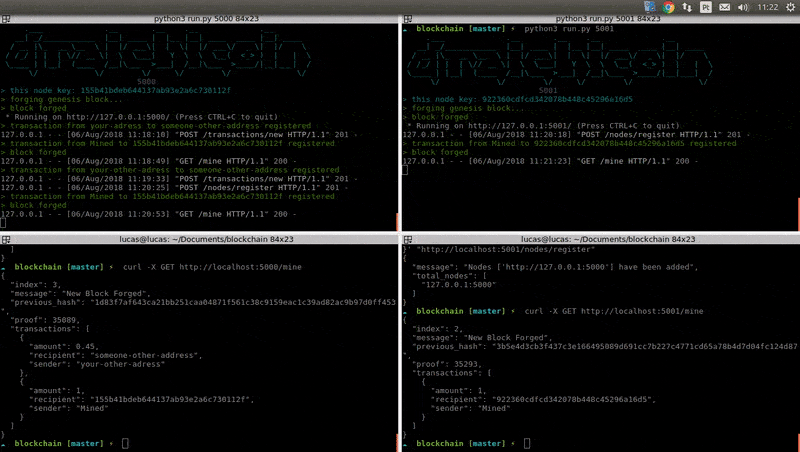

# Blockchain



---
## Setup
```sh
# setup nodes
python3 run.py 5000
python3 run.py 5001

# register the node neighbor
curl -X POST -H "Content-Type: application/json" -d '{
 "nodes": ["http://127.0.0.1:5001"]
}' "http://localhost:5000/nodes/register"

curl -X POST -H "Content-Type: application/json" -d '{
 "nodes": ["http://127.0.0.1:5000"]
}' "http://localhost:5001/nodes/register"

# add some treansactions
curl -X POST -H "Content-Type: application/json" -d '{
 "sender": "your-adress",
 "recipient": "someone-other-address",
 "amount": 0.15
}' "http://localhost:5000/transactions/new"

curl -X POST -H "Content-Type: application/json" -d '{
 "sender": "someone-adress",
 "recipient": "another-address",
 "amount": 0.05
}' "http://localhost:5001/transactions/new"

# mine
curl -X GET http://localhost:5000/mine
curl -X GET http://localhost:5001/mine

#consensus algorithm
curl -X GET http://localhost:5000/nodes/resolve
curl -X GET http://localhost:5001/nodes/resolve

# compare chains
curl -X GET http://localhost:5000/chain
curl -X GET http://localhost:5001/chain
```
---
## Credits
- This project is built on top of [dfv project](https://github.com/dvf/blockchain), see more [here](https://hackernoon.com/learn-blockchains-by-building-one-117428612f46)

